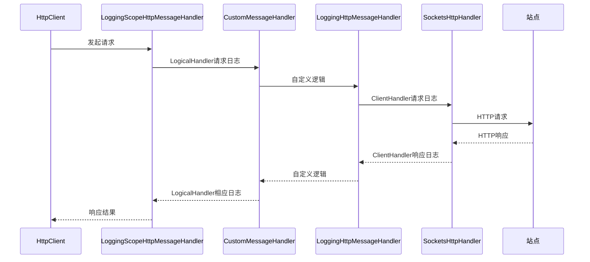

### HttpClientFactory：管理向外请求的最佳实践

- HttpClient 类是我们用来处理远程调用的
- 在.NET Core中，提供了HttpClientFactory来更好的管理HttpClient

###### 组件包

- Microsoft.Extensions.Http

###### 核心能力

- 管理内部HttpMessageHandler的声明周期，灵活应对资源问题和DNS刷新问题
- 支持命名化、类型化配置，集中管理HttpClient配置，避免冲突
- 灵活的出站请求管道配置，轻松管理请求声明周期
- 内置管道最外层和最内层日志记录器，有 Information 和 Trace 输出

###### 核心对象

- HttpClient
- HttpMessageHandler
- SocketsHttpHandler
- DelegatingHandler
- IHttpClientFactory
- IHttpClientBuilder

###### HttpClient请求管道模型

HttpClient 负责调用 DelegatingHandler()。

SocketHandler来处理真正的HTTP请求，发起远程调用，并接受响应。

中间的DelegatingHandler是我们的管道处理器，可以理解为这就是我们的中间件部分。

内置中间件中LoggingScopeHttpMessageHandler为最外层中间件，用来记录管道最外层请求、响应日志，LoggingHttpMessageHandler用来记录管道最内层的HTTP请求日志，可以记录SocketsHttpHandler发起请求前和响应的日志，CustomMessageHandler是开发人员的扩展点，可以通过类似注册中间件一样，将我们自定义的handler注册到管道中

###### HttpClientFactory 创建 HttpClient 模式

- 工厂模式
- 命名客户端模式
  - 可以为不同客户端设置不同的header、不同的请求地址的根路径(BaseAddress)
  - 不同的客户端各自独立管理内部的 HttpHandler 的生命周期，默认是2分钟，可自定义(SetHandlerLifetime)
  - 可以为不同客户端配置 HTTP 管道处理程序(AddHttpMessageHandler)
- 类型化客户端模式
  - 与命名模式本质上是一样的，区别是这里命名是采用的客户端的类型名称，来作为HttpClient的配置的名称
  - 不需要采用自定义字符串的方式进行命名
  - 不需要直接去使用 HttpClientFactory ，可以直接获取到对应的 HttpClient

###### 总结

- 在实际项目中，建议通过**类型化客户端模式**来使用 HttpClientFactory，免去自定义字符串命名管理维护的弊端
- 可以为不同服务的客户端设置不同的**BaseAddress**、**生命周期**、**管道处理程序**

